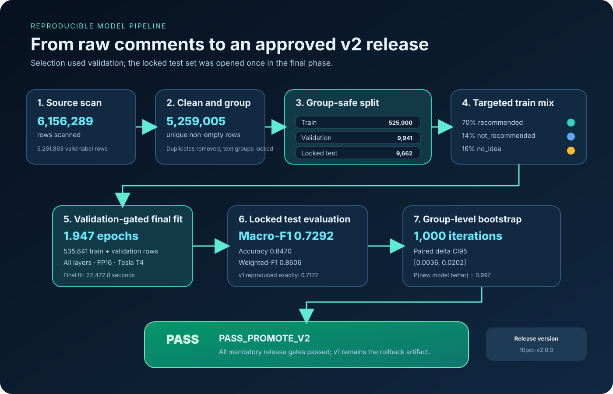
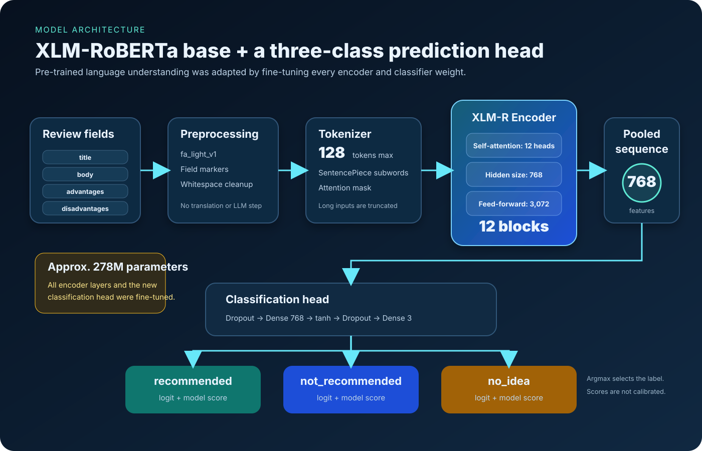
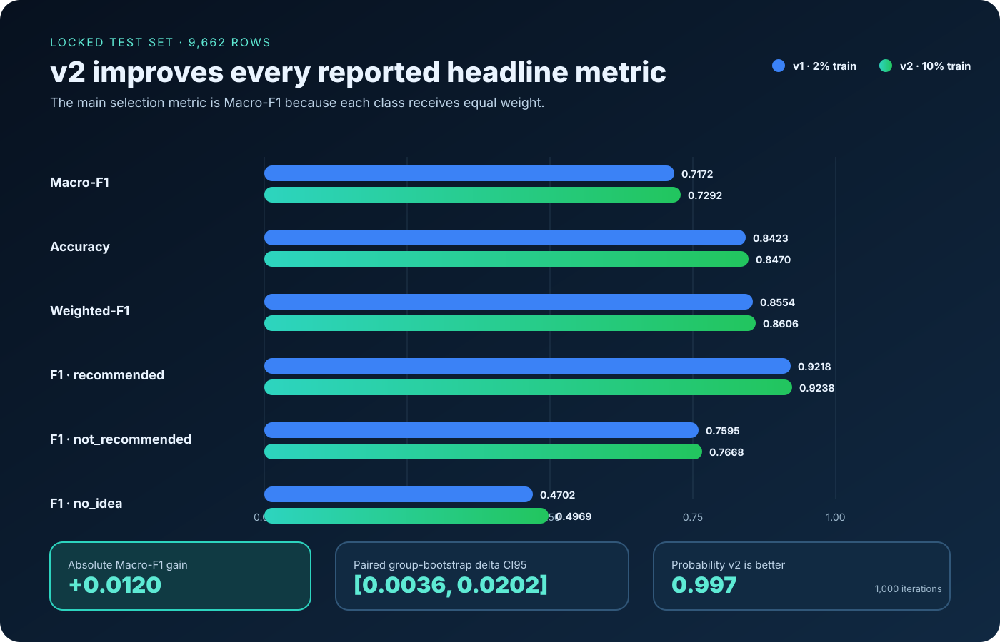
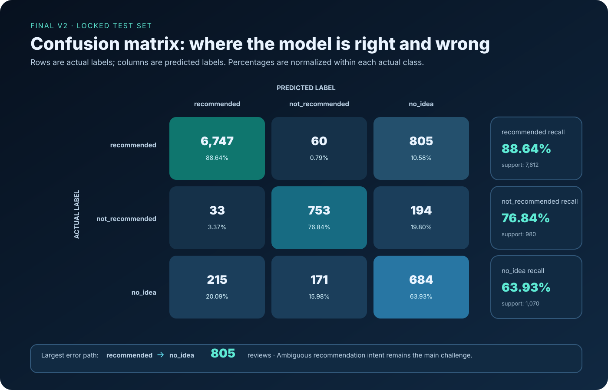
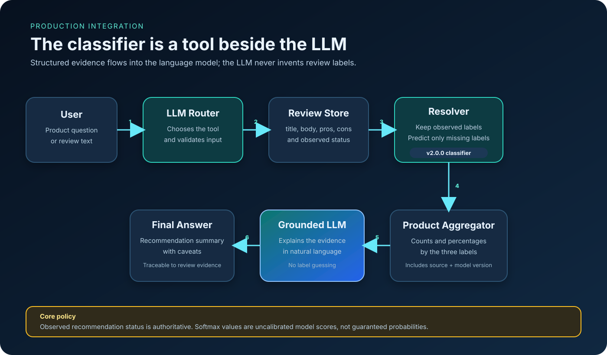

# Digikala Purchase Recommendation Status

An evaluated Persian review classifier for the third part of the Quera AI project: predict whether a Digikala review indicates `recommended`, `not_recommended`, or `no_idea`.

The current release is **`digikala-rec-xlm-roberta-10pct-v2.0.0`**. It is a fully fine-tuned XLM-RoBERTa classifier designed to operate as a deterministic NLP tool beside the other teams' LLM components. It is not itself a conversational LLM.

> **Final decision:** `PASS_PROMOTE_V2`
>
> **Locked-test Macro-F1:** `0.729173`
>
> **Improvement over v1:** `+0.012002`
>
> **Paired group-bootstrap delta CI95:** `[0.003630, 0.020183]`

[Read the complete evaluation report](docs/EVALUATION.md)



## Project scope

This repository implements purchase recommendation status prediction from four optional review fields: title, body, advantages, and disadvantages. The output label is exactly one of:

```text
recommended
not_recommended
no_idea
```

This component supplies structured evidence to the final application. The LLM remains responsible for dialogue, explanation, orchestration, and combining this signal with other project components. The classifier remains responsible for the recommendation label.

## Why XLM-RoBERTa

The project first established non-neural TF-IDF/LinearSVC baselines, then fully fine-tuned two Transformer encoder candidates on the same group-safe validation split:

| Candidate | Validation Macro-F1 |
|---|---:|
| Word TF-IDF + LinearSVC | 0.680620 |
| ParsBERT | 0.721923 |
| XLM-RoBERTa base | **0.733375** |

XLM-RoBERTa was selected because it achieved the best validation Macro-F1, including stronger minority-class behavior. The 10% training expansion then raised validation Macro-F1 to `0.743702` and passed the separate promotion gate before the locked test was opened.

The released architecture uses:

- `FacebookAI/xlm-roberta-base`
- pinned model revision `e73636d4f797dec63c3081bb6ed5c7b0bb3f2089`
- 12 Transformer encoder layers, hidden size 768, and 12 attention heads
- approximately 278 million parameters and a three-output classification head
- full fine-tuning; the encoder was not frozen
- class-weighted cross-entropy
- maximum length 128 tokens
- fp16 training and inference on a Tesla T4



## Data preparation

The source file was pinned to:

- repository: [`RadeAI/Digikala_comments_products`](https://huggingface.co/datasets/RadeAI/Digikala_comments_products/tree/89c3133b169c8d3793db8834f56f32fee33d9db0)
- revision: `89c3133b169c8d3793db8834f56f32fee33d9db0`
- source SHA-256: `c7a8aa3020334fde8ec24944576a03fe5785e6fe12cd01042f5836632ddf8297`

The final audit scanned 6,156,289 rows and found 5,261,863 rows with supported labels. After removing repeated comment IDs and empty text, 5,259,005 unique-ID, non-empty rows formed the 10% sampling denominator.

### Group-safe splitting

`text_group_id` is derived from normalized review text. The body is used when available; otherwise the complete tagged text is used. Exact normalized duplicates therefore share one group ID. A text group is placed in only one split, preventing the same review text from appearing in training and again in validation or test. This is duplicate-control grouping, not topic or product clustering.

The 10% expansion preserved the original 2% train split and froze the original validation and test IDs and groups. New, non-conflicting groups were selected deterministically with seeded SHA-256 ordering.

| Split | Rows | Text groups | `recommended` | `not_recommended` | `no_idea` |
|---|---:|---:|---:|---:|---:|
| Train | 525,900 | 470,819 | 368,130 | 73,626 | 84,144 |
| Validation | 9,941 | 8,249 | 7,678 | 993 | 1,270 |
| Locked test | 9,662 | 8,215 | 7,612 | 980 | 1,070 |

The training split was intentionally minority-enriched to 70% `recommended`, 14% `not_recommended`, and 16% `no_idea`. This is a training target, not the distribution of the full source dataset. Balanced class weights were also used.

The validation run selected step 16,000, epoch `1.947032`. The release model was then refit on train plus validation, 535,841 rows, for that selected epoch count. Test rows were excluded from training and model selection.

## Final results

| Model | Training scope | Macro-F1 | Weighted-F1 | Accuracy |
|---|---|---:|---:|---:|
| Word TF-IDF + LinearSVC | 2% split | 0.661141 | 0.838370 | 0.841544 |
| XLM-RoBERTa v1 | 2% split | 0.717170 | 0.855353 | 0.842269 |
| XLM-RoBERTa v2 | 10% split | **0.729173** | **0.860604** | **0.847030** |

| Class | Support | v1 F1 | v2 precision | v2 recall | v2 F1 |
|---|---:|---:|---:|---:|---:|
| `recommended` | 7,612 | 0.921837 | 0.964546 | 0.886364 | **0.923804** |
| `not_recommended` | 980 | 0.759481 | 0.765244 | 0.768367 | **0.766802** |
| `no_idea` | 1,070 | 0.470194 | 0.406417 | 0.639252 | **0.496912** |

Macro-F1 is primary because the test set is dominated by `recommended`. The v2 improvement over v1 was evaluated with 1,000 paired bootstrap iterations at the `text_group_id` level; its confidence interval remained above zero.





The [evaluation report](docs/EVALUATION.md) includes validation/test separation, both confusion matrices, all 12 slice comparisons, error counts, statistical intervals, release gates, T4 latency, artifact provenance, and limitations.

## Public Kaggle releases

Large models and evaluation artifacts are hosted on Kaggle rather than committed to Git.

1. [Delivery source bundle](https://www.kaggle.com/datasets/maslri/digikala-recommendation-delivery-source) - v1 source, original notebooks, inference/preprocessing code, tests, example request, requirements, and selected evaluation documentation. It does not contain the large trained model.
2. [XLM-RoBERTa v1 release](https://www.kaggle.com/datasets/maslri/digikala-recommendation-status-xlm-roberta-v1) - complete v1 model, tokenizer, training evidence, locked-test predictions, evaluation artifacts, source delivery, and integrity manifest. Retained for rollback and exact paired comparison.
3. [10% validation gate](https://www.kaggle.com/datasets/maslri/digikala-recommendation-10pct-validation-pass) - one summary JSON recording candidate metrics, sampling audit, class weights, chosen epoch, locked-row checks, and `PASS_TO_FINAL`. This is gate evidence, not a deployable model.
4. [XLM-RoBERTa 10% v2 release](https://www.kaggle.com/datasets/maslri/digikala-recommendation-status-xlm-roberta-10-v2) - current deployable model and tokenizer plus locked-test predictions, class metrics, confusion matrix, failures, slices, bootstrap, latency, metadata, integration contract, release card, and SHA-256 manifests.

Use release 4 for new integrations. Keep release 2 available for rollback.

## Repository layout

```text
.
|-- README.md
|-- assets/visuals/                 # Static and animated SVG explanations
|-- docs/EVALUATION.md              # Standalone Section 3/4 evaluation report
|-- notebooks/                      # Clean, reusable Kaggle notebooks
|   `-- implemented/                # Kaggle-executed notebooks with outputs
`-- STUDY/                          # Supporting course notes; not experiment outputs
```

| Notebook | Purpose | Main output |
|---|---|---|
| `01_kaggle_classical_baselines.ipynb` | Audit, group-safe 2% split, classical candidates | LinearSVC baseline and frozen split manifest |
| `02_kaggle_transformer_encoders.ipynb` | Fully fine-tune ParsBERT and XLM-RoBERTa | Selected v1 model |
| `03_kaggle_recommendation_evaluation.ipynb` | Section 4 evaluation of v1 | Metrics, bootstrap, slices, errors, latency, release decision |
| `04_kaggle_build_final_delivery.ipynb` | Package and smoke-test v1 | v1 deployable directory |
| `05_kaggle_xlm_roberta_10pct.ipynb` | Two-phase 10% validation and final run | v2 gate, final model, locked-test evidence |
| `06_kaggle_package_xlm_roberta_10pct_v2.ipynb` | Repackage saved output without retraining | Clean 24-file v2 release |

The `notebooks/implemented/` directory contains the notebooks actually executed on Kaggle, including saved output cells. The numbered notebooks in `notebooks/` are the reusable sources; notebooks 05 and 06 also have plain-Python mirrors.

## Integrate the released model with an LLM system



### 1. Attach and validate v2

In Kaggle, use **Add Input** with `maslri/digikala-recommendation-status-xlm-roberta-10-v2`. Outside Kaggle, download and extract the same public dataset. Keep the complete `model/` directory together.

Required packages are `torch`, `transformers`, `sentencepiece`, and `safetensors`. The recorded release environment used Python 3.12.13, PyTorch `2.10.0+cu128`, Transformers `4.57.6`, and a Tesla T4.

```python
import json
from pathlib import Path

roots = list(Path("/kaggle/input").rglob(
    "digikala_recommendation_status_xlm_roberta_10pct_v2"
))
roots = [p for p in roots if (p / "model" / "model.safetensors").is_file()]
if len(roots) != 1:
    raise RuntimeError(f"Expected one v2 release root, found {roots}")

release_root = roots[0]
release = json.loads((release_root / "release_dataset_summary.json").read_text())
expected = {
    "decision": "PASS",
    "release_source_decision": "PASS_PROMOTE_V2",
    "model_version": "digikala-rec-xlm-roberta-10pct-v2.0.0",
    "model_artifact_sha256": "bc99ce62255893faf29fa46c27b3faa798b59fd09d4d31b5ab5ee280df8c570d",
}
for key, value in expected.items():
    if release.get(key) != value:
        raise RuntimeError(f"Release mismatch for {key}: {release.get(key)!r}")

model_dir = release_root / "model"
```

For a complete integrity check, run `sha256sum -c RELEASE_MANIFEST.sha256` from the release root on Linux. Do not load an artifact when identity checks fail.

### 2. Load once and reproduce `fa_light_v1`

```python
import re
import unicodedata

import torch
from transformers import AutoModelForSequenceClassification, AutoTokenizer

LABELS = ["recommended", "not_recommended", "no_idea"]
MAX_LENGTH = 128
NULL_TOKENS = {"", "nan", "none", "null", "na", "n/a"}
CHAR_MAP = str.maketrans({"\u064a": "\u06cc", "\u0649": "\u06cc", "\u0643": "\u06a9"})


def normalize_text(value):
    text = "" if value is None else str(value)
    if text.strip().lower() in NULL_TOKENS:
        return ""
    text = unicodedata.normalize("NFKC", text).translate(CHAR_MAP)
    text = text.replace("\ufeff", "")
    return re.sub(r"\s+", " ", text).strip()


def build_model_text(review):
    parts = []
    for field, tag in (
        ("title", "[TITLE]"),
        ("body", "[BODY]"),
        ("advantages", "[ADVANTAGES]"),
        ("disadvantages", "[DISADVANTAGES]"),
    ):
        value = normalize_text(review.get(field))
        if value:
            parts.append(f"{tag} {value}")
    if not parts:
        raise ValueError("At least one non-empty review text field is required")
    return " ".join(parts)


device = torch.device("cuda" if torch.cuda.is_available() else "cpu")
tokenizer = AutoTokenizer.from_pretrained(
    model_dir, use_fast=True, local_files_only=True
)
model = AutoModelForSequenceClassification.from_pretrained(
    model_dir, local_files_only=True
).to(device).eval()
```

Load the model once per worker, not once per request.

### 3. Expose a stable batch adapter

```python
def predict_recommendation_status(reviews):
    texts = [build_model_text(review) for review in reviews]
    encoded = tokenizer(
        texts,
        truncation=True,
        max_length=MAX_LENGTH,
        padding=True,
        return_tensors="pt",
    ).to(device)

    with torch.inference_mode():
        logits = model(**encoded).logits
        scores = torch.softmax(logits, dim=-1).cpu()

    outputs = []
    for row in scores:
        label_id = int(row.argmax())
        outputs.append({
            "label": LABELS[label_id],
            "scores": {
                label: float(row[index])
                for index, label in enumerate(LABELS)
            },
            "source": "model_prediction",
            "model_version": "digikala-rec-xlm-roberta-10pct-v2.0.0",
        })
    return outputs
```

Scores are uncalibrated model outputs, not guaranteed probabilities.

### 4. Preserve observed labels

If a review already has one of the three valid labels, retain it with `source = observed`; call the model only when the label is absent. For inferred rows, store `source = model_prediction` and the release version. Never silently overwrite an observed label.

### 5. Register the classifier tool

The application-facing adapter contract is:

```json
{
  "name": "predict_recommendation_status",
  "input": {
    "title": "string|null",
    "body": "string|null",
    "advantages": "string|null",
    "disadvantages": "string|null"
  },
  "output": {
    "label": "recommended|not_recommended|no_idea",
    "scores": {
      "recommended": "uncalibrated float",
      "not_recommended": "uncalibrated float",
      "no_idea": "uncalibrated float"
    },
    "source": "model_prediction",
    "model_version": "digikala-rec-xlm-roberta-10pct-v2.0.0"
  }
}
```

The public release's `metadata/recommendation_10pct_integration_contract.json` is the smaller model-level contract. The adapter above extends it with application provenance.

### 6. Aggregate before prompting the LLM

For a product-level answer, resolve each review label, then calculate counts and percentages for all three classes. Send the LLM `product_id`, total reviews, class counts, class percentages, observed count, predicted count, and model version. Aggregate labels or row counts, not mean softmax scores.

The LLM may explain this structured evidence, but it must not invent replacement labels, present uncalibrated scores as probabilities, or hide the distinction between observed and inferred labels.

### 7. Define failures and monitoring

- Empty text: return `INVALID_INPUT`; do not invoke the model.
- Missing or invalid artifact: return `MODEL_UNAVAILABLE`; do not let the LLM guess.
- Unknown label or schema mismatch: reject and log the contract error.
- Log latency, input completeness, label, source, and model version.
- Pin the Kaggle dataset version and keep v1 available for rollback.
- Monitor class rates, missing fields, latency, and reviewed errors for drift.

The [animated training and inference flow](assets/visuals/training-inference-flow-animated.svg) provides a compact visual walkthrough.

## Reproducibility identifiers

| Artifact | SHA-256 or canonical digest |
|---|---|
| Source CSV | `c7a8aa3020334fde8ec24944576a03fe5785e6fe12cd01042f5836632ddf8297` |
| Expanded split manifest | `a9a2fdd44c937b6bc0c9e2042b018b72b9dbfdd839c1a23b65dd851cfca221d3` |
| Frozen validation split | `de8552bf7d278b44c71a7d30c34c3aeb58c124e216640a6880aeb38ed52bf5bb` |
| Frozen test split | `bd6f5e47bf368a77eaf9fd2bf8f44416d0e1878c59b477fc7794be316fdae9b5` |
| v1 model directory | `f343a3bcee07c68beaabece504a9efd1f200661e376f0b5235c75c7c9c394cf4` |
| v1 predictions used by v2 | `15d840026c212aafae010bd08a3962458cf02703265ced6e861eaec42af1d0b2` |
| v2 model directory | `bc99ce62255893faf29fa46c27b3faa798b59fd09d4d31b5ab5ee280df8c570d` |
| v2 test predictions | `f20eabe60134c77c57c6020c36a5db64fdbeb3d952e603178ccc4345e4f7ea57` |

## Limitations

- Exact normalized duplicates are group-safe, but near-duplicate paraphrases and product-level correlation may remain.
- v1 and v2 use the same fixed test set. Future work should add a new temporal or external holdout.
- `no_idea` improved but remains the weakest class at 0.496912 F1.
- Performance under temporal or cross-domain shift is unknown.
- Scores were not calibrated; no abstention threshold is claimed.
- v2 has automated failure artifacts but no completed human evaluation.
- T4 latency excludes network, queueing, orchestration, LLM latency, and cold starts.
- The 87-row truncated and 148-row long slices are too small for broad claims.

## Release status

The evidence supports v2 as the best tested release in this repository. It passed validation before final testing, improved all three class F1 scores over official v1, produced a positive paired group-bootstrap interval, and stayed far below the hard latency budget. Integrators should use the v2 Kaggle release, preserve label provenance, keep v1 for rollback, and follow the limitations above.
