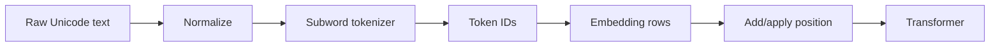

# 02 - Tokenization, Embeddings, and the Input Pipeline

## What you will learn

You will trace raw Unicode text through normalization, tokenization, IDs, token embeddings, and position information.

## Page-by-page lesson

### Page 1 - Course topic

Transformers cannot consume strings directly. The input pipeline maps text into a sequence of dense vectors while preserving token identity and order.

### Page 2 - The input pipeline

The stages are: raw text → optional normalization → tokenizer → integer token IDs → embedding lookup → position signal → Transformer states. Tokenization is usually fixed after training; embeddings are learned with the model.

### Page 3 - Why text becomes numbers

A neural layer performs arithmetic on tensors. A token ID is only an index, not a meaningful numerical magnitude: ID 900 is not “more” than ID 100. The embedding table maps each ID to a learned vector where useful relationships can be represented geometrically.

### Page 4 - Tokens are not words

Word tokenization creates an impossible open-vocabulary problem. Character or byte tokenization covers everything but creates long sequences. Subwords compromise: common strings become single units while rare words split into reusable pieces. Spaces and punctuation may be tokens or parts of tokens.

### Page 5 - Byte Pair Encoding (BPE)

BPE begins with small units and repeatedly merges the most frequent adjacent pair. A toy corpus containing many `l`+`o` pairs might learn `lo`, then `low`. Training learns merge rules; encoding applies them in order. Modern variants often begin with bytes for complete coverage.

### Page 6 - BPE, WordPiece, and Unigram

BPE greedily learns frequent merges. WordPiece chooses pieces using a likelihood-inspired score and commonly marks continuation pieces. Unigram starts with a large candidate vocabulary and removes pieces while preserving likely segmentations. They solve the same open-vocabulary trade-off differently.

### Page 7 - SentencePiece

SentencePiece is a tokenizer framework that can train BPE or Unigram directly on raw text. It treats whitespace explicitly, often with a visible marker such as `▁`. This helps languages whose preprocessing should not rely on English-style spaces.

### Page 8 - Vocabulary-size trade-off

A small vocabulary shrinks the embedding/output matrices but lengthens sequences. A large vocabulary shortens common text but spends many parameters on rows and may handle rare forms poorly. Since dense attention scales roughly with sequence length squared, tokenizer efficiency affects compute.

### Page 9 - Embedding lookup

For vocabulary size \(V\) and hidden size \(d\), the embedding matrix is \(E\in\mathbb{R}^{V\times d}\). Token ID \(i\) selects row \(E_i\). A sequence of \(n\) IDs becomes an \(n\times d\) matrix. Gradients gradually shape these vectors during training.

### Page 10 - Position and order

Token identity alone cannot distinguish “dog bites person” from “person bites dog.” The model adds or applies position information. Architectures may use learned absolute embeddings, sinusoidal encoding, relative biases, or rotary positional embeddings (RoPE).

### Page 11 - Multilingual tokenization

Scripts, morphology, data balance, and Unicode variants affect segmentation. A tokenizer trained mostly on English may split Persian or another underrepresented language into more tokens, increasing cost and shortening the effective amount of text that fits in context.

### Page 12 - Typos

Normalization and tokenization do not understand that a spelling is wrong. A typo often changes the token sequence. The Transformer may infer the intended form from context because similar corruptions appeared during training, but correction is learned behavior rather than a tokenizer feature.

### Page 13 - Takeaways

Tokenization controls sequence length and boundaries; IDs select learned vectors; position signals add order. Seemingly small text differences can alter every downstream representation.

### Page 14 - Sources

Tokenizer behavior should be checked with the exact model's tokenizer. Algorithm names alone are insufficient because vocabulary, normalization, special tokens, and implementation choices differ.

## Worked example 1 - Toy BPE

Corpus: `low`, `low`, `lower`.

1. Start: `l o w`, `l o w`, `l o w e r`.
2. Most frequent pair is `l o`; merge to `lo`.
3. Now `lo w` is frequent; merge to `low`.
4. Encodings can become `low` and `low e r`.

Real training uses large corpora and tie-breaking rules, but the principle is repeated compression of frequent adjacent patterns.

## Worked example 2 - Embedding shapes

Let vocabulary size \(V=10{,}000\), hidden size \(d=768\), and input length \(n=20\).

- Embedding parameters: \(10{,}000\times768=7{,}680{,}000\).
- Selected input tensor: \(20\times768\), not \(20\times10{,}000\).
- With batch size 8: input states have shape \(8\times20\times768\).

The ID vector itself is not fed as a continuous scalar; each ID performs a row lookup.

## Worked example 3 - Token budget

If English averages 1.3 tokens per word and another language averages 2.6, a 4,096-token context fits roughly 3,151 English words but only 1,575 words in the second language, before instructions and output space. This is a product-quality and cost issue.

## Visual summary

## Common misconceptions

- Token IDs contain semantic distance. They are arbitrary indices.
- One token equals one word. Tokens can be bytes, punctuation, spaces, words, or fragments.
- Embeddings are fixed dictionary definitions. They are trainable vectors optimized for prediction.
- The same text has the same tokens in every model. Tokenizers differ.

## Practice

1. Invent a character-level segmentation and a subword segmentation for `unhappiness`.
2. Calculate embedding parameters for \(V=32{,}000\), \(d=4{,}096\).
3. Explain why changing one Unicode character can change cost and output.
4. Use any installed tokenizer later and compare an English sentence, a Persian sentence, code, and an emoji string.

## Mastery check

You are ready when you can state the shape and meaning of every object in text → tokens → IDs → embeddings → positioned vectors.

