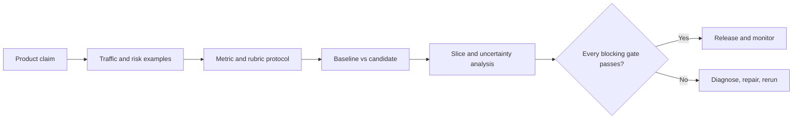

# 10 - Evaluation of Large Language Models

## Goal

Turn model outputs into evidence for a release decision. You will learn how to define claims, construct representative evaluation sets, choose metrics, calibrate model judges, design human studies, and block releases when one important safety or operational gate fails.

## Page-by-page lesson

### Page 1 - Evaluation as a decision system

An evaluation is not just a benchmark score. It connects a claim, representative examples, measurement procedures, thresholds, and a decision. The same model can be acceptable for brainstorming and unacceptable for medical advice because the claims and failure costs differ.

### Page 2 - Four organizing questions

Ask: What must the evaluation prove? Which examples represent normal use and risk? Which measurements match the desired behavior? What evidence is sufficient to ship, reject, or investigate? These questions prevent metric-first evaluation.

### Page 3 - Evaluation across adaptation methods

Prompting, RAG, fine-tuning, and tools change different parts of a system, but release evaluation must test the final assembled product. For example, a RAG retriever can improve while answer grounding gets worse; both component and end-to-end tests are needed.

### Page 4 - Start with a measurable claim

Write the claim before selecting a metric. A credible claim names users, scenario, expected behavior, costly failures, baseline, threshold, and decision. “The new model is better” is not measurable; “macro-F1 improves by at least 0.05 while security recall remains above 0.90” is.

### Page 5 - Construct the evaluation set

Combine representative traffic, high-consequence cases, historical failures, difficult boundaries, and controlled perturbations. Sample by prevalence for average performance, but deliberately oversample rare severe failures for risk assessment. Report slice results rather than hiding them inside one average.

### Page 6 - Contamination

If evaluation items or close variants were used for training, prompting, model selection, or repeated manual tuning, performance can resemble memorization. Deduplicate by identity and similarity, protect final holdouts, track exposure, and refresh tests. Hidden or paraphrased leakage can remain, so contamination controls reduce risk rather than prove absence.

### Page 7 - Perplexity

For tokens \(x_1,\ldots,x_T\), perplexity is

\[
\operatorname{PPL}=\exp\left(-\frac{1}{T}\sum_{t=1}^{T}\log p(x_t\mid x_{<t})\right).
\]

Lower perplexity means better predictive fit on that tokenized corpus. Comparisons require the same corpus, tokenizer, context procedure, and loss masking. Perplexity does not directly prove instruction following, factuality, or assistant quality.

### Page 8 - Classification metrics

Accuracy is correct predictions divided by all examples. Precision asks how often predicted positives are correct; recall asks how many actual positives were found; F1 is their harmonic mean. Macro-F1 gives each class equal weight, while micro-F1 aggregates decisions and is influenced by common classes. Choose according to the real cost of false positives and false negatives.

### Page 9 - Exact match and token F1

Exact match gives credit only when normalized prediction and reference match. Token F1 gives partial credit from token overlap. Normalization rules - case, punctuation, articles, whitespace, and accepted aliases - are part of the experiment, not cleanup performed after results are known.

### Page 10 - Multiple-choice protocols

Dataset name alone does not define an evaluation. Record prompt template, number and selection of demonstrations, choice ordering, scoring method, decoding, model version, tokenizer, and retry behavior. Small protocol changes can alter accuracy, so reproducibility needs the full configuration.

### Page 11 - Generation metrics

BLEU emphasizes n-gram precision and brevity; ROUGE often emphasizes reference overlap or recall; BERTScore compares contextual token embeddings. These metrics measure forms of similarity. None alone proves correctness, grounding, safety, usefulness, or factual truth.

### Page 12 - BERTScore

BERTScore matches candidate and reference tokens through contextual embedding similarity, so semantically similar paraphrases can score well despite different wording. It can still reward fluent semantic similarity to a reference that is itself incomplete, and it does not verify claims against source evidence.

### Page 13 - Metric disagreement

Disagreement is diagnostic. A correct paraphrase may receive low exact-match or ROUGE but high semantic similarity. An incorrect answer can reuse many reference words and receive high overlap. Inspect disagreement cases to learn what each metric is actually rewarding.

### Page 14 - LLM-as-a-judge

A model judge needs a task, candidate response, reference evidence when available, and an observable rubric with separate criteria. Calibrate it against human labels and define abstention. The judge is a scalable measurement instrument, not ground truth.

### Page 15 - Position bias

Pairwise judges may prefer whichever response appears first or second. Counterbalance by evaluating both A/B and B/A, then measure disagreement. The slide's cited experiment found more order conflicts when answer quality was close, which is exactly where careless judging is most consequential.

### Page 16 - Judge controls

Use explicit criteria, counterbalanced order, human calibration, repeated judgments where justified, stable judge versions, and analysis by slice. Measure agreement, false accept/reject rates, and abstention behavior. These controls quantify bias; they cannot eliminate all model-judge limitations.

### Page 17 - Human evaluation

Human evaluation is an experiment. Specify expertise, instructions, blinding, absolute versus pairwise rating, sampling, number of raters, adjudication, compensation, and agreement statistics. A domain expert may be needed for correctness while target users may be better for usefulness.

### Page 18 - Deployment-matched risk

Generic benchmarks help reveal robustness, truthfulness, toxicity, bias, privacy, or security failure modes. Product-specific cases determine release because actual tools, users, languages, data, and consequences differ. Include paraphrases, typos, long contexts, unanswerable questions, adversarial instructions, and multilingual slices as appropriate.

### Page 19 - Complete-system suite

Evaluate the task, grounding, format, safety, robustness, operational performance, and regressions. Model, prompt, retrieval, tool interfaces, decoding, and post-processing all affect the final behavior. Keep component metrics for diagnosis and end-to-end gates for decisions.

### Page 20 - Worked release decision

The example candidate improves macro-F1, security-intent recall, JSON validity, and Persian human preference, while latency rises and refusal errors regress. A safety regression is a blocking gate: gains elsewhere must not be averaged into one passing score. Latency requires comparison with its explicit budget.

### Page 21 - Four-question synthesis

Define the claim, construct traffic and risk examples, select measurements that reflect the claim, and predefine the decision rule. Report uncertainty and slices, not only a point estimate.

### Page 22 - Sources

Use primary benchmark and metric papers for definitions, authoritative library documentation for implementations, and complete evaluation configuration for reproducibility. Record dates and versions because models and evaluation harnesses change.

## Worked example 1 - Confusion matrix and metrics

Suppose a security-intent classifier produces:

| | Predicted security | Predicted other |
|---|---:|---:|
| Actual security | 45 | 5 |
| Actual other | 15 | 935 |

Then:

- Precision = \(45/(45+15)=0.75\).
- Recall = \(45/(45+5)=0.90\).
- F1 = \(2(0.75)(0.90)/(0.75+0.90)\approx0.818\).
- Accuracy = \((45+935)/1000=0.98\).

Accuracy looks excellent because the negative class dominates, but precision shows that one quarter of security alerts are false alarms. The release decision must reflect the costs of missed security requests and unnecessary escalation.

## Worked example 2 - Confidence interval intuition

If a model answers 85 of 100 independent test cases correctly, accuracy is 0.85. A rough 95% normal confidence interval is:

\[
0.85\pm1.96\sqrt{0.85(0.15)/100}\approx0.85\pm0.07.
\]

The sample supports a range around 0.78-0.92, not certainty that true performance is exactly 0.85. For small samples or extreme proportions, use Wilson or exact intervals; clustered user data may require resampling by user or conversation rather than treating every row as independent.

## Worked example 3 - Calibrating an LLM judge

Create 200 human-labeled candidate answers spanning quality levels and risk slices. Ask the judge to score correctness, grounding, and instruction compliance separately. Measure agreement and false-pass rates, repeat pairwise cases in reversed order, inspect disagreements, and select an abstention rule. Recalibrate whenever the judge model, prompt, rubric, or domain changes.

## A practical release card

```text
Claim: Candidate improves multilingual intent routing for support traffic.
Baseline: Current production model and prompt.
Target gates:
- macro-F1 >= 0.84
- security recall >= 0.90
- Persian expert preference >= 55%
Non-regression gates:
- JSON validity >= 99.5%
- safe-request refusal <= 2%
- unsafe-request compliance <= 0.5%
- p95 latency <= 2.0 s
Decision: Ship only if every blocking gate passes its confidence rule.
```

## Visual evaluation flow



## Common mistakes

- Reporting one average while a rare critical slice fails.
- Selecting a metric because it is popular rather than because it measures the claim.
- Reusing the release holdout during prompt iteration.
- Treating LLM-judge scores as objective truth.
- Changing normalization, prompts, or thresholds after seeing candidate results.
- Evaluating the base model while shipping a larger system with retrieval and tools.

## Practice

1. Write a measurable release claim for a grounded policy assistant.
2. Calculate precision, recall, and F1 for TP=32, FP=8, FN=18.
3. Design an evaluation set containing ordinary traffic, costly failures, historical bugs, and perturbations.
4. Compare exact match, token F1, ROUGE, and BERTScore for a correct paraphrase.
5. Create a judge rubric with three observable dimensions and an abstention condition.
6. Decide whether a candidate should ship if average quality improves but unsafe compliance rises from 0.2% to 1.5%.

## Mastery check

You are ready when you can start from a product claim, build representative and risk-weighted evidence, calculate task metrics, quantify judge limitations, and make a gate-based release decision without hiding regressions in an average.

