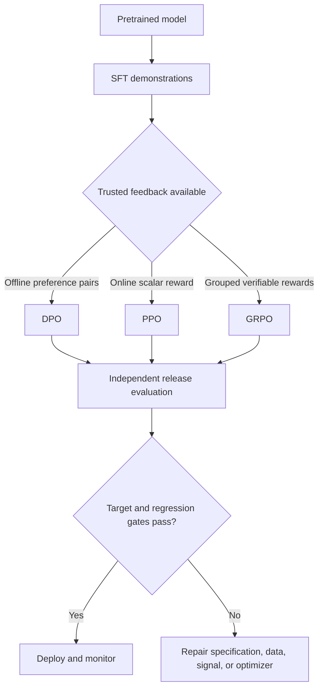

# 11 - Post-Training and Alignment

## Goal

Understand how demonstrations, preferences, rewards, and reinforcement learning shape a pretrained model's behavior. You will compare SFT, reward modeling, PPO, DPO, and GRPO; analyze reward hacking and safety trade-offs; and design evaluation gates for aligned systems.

## Page-by-page lesson

### Page 1 - Alignment as behavioral optimization

Post-training uses evidence about desired behavior to shape a pretrained model. Alignment is not a universal mathematical definition of human values. It is a specified, measured target for tasks, instruction priority, truthfulness, safety, style, and uncertainty in a particular deployment.

### Page 2 - Four organizing questions

Ask: What behavior is desired? What feedback represents it? Which optimizer can use that feedback? What independent evaluation proves improvement without unacceptable regressions? Keeping these separate prevents choosing an algorithm before defining the objective.

### Page 3 - What each training stage teaches

Pretraining learns broad language and task capabilities through next-token prediction. SFT demonstrates desired responses. Preference optimization teaches trade-offs between plausible alternatives. Verifiable-reward training can strengthen behaviors with checkable outcomes. Each stage depends on capabilities and limitations inherited from earlier stages.

### Page 4 - Behavioral specification

Terms such as helpful, honest, harmless, and controllable can conflict. A specification must define users, tasks, instruction hierarchy, refusal boundaries, uncertainty behavior, privacy, tool permissions, tone, and ambiguous boundary cases. A scalar score cannot express the whole specification by itself.

### Page 5 - Classic RLHF pipeline

The InstructGPT-style stack has three stages: collect expert demonstrations and fine-tune with SFT; collect chosen/rejected comparisons and train a reward model; generate policy rollouts and optimize them with PPO while constraining drift from a reference. RLHF is therefore a data-and-evaluation system plus an RL algorithm.

### Page 6 - Demonstrations versus preferences

SFT is appropriate when experts can write the desired response. Preferences are useful when choosing the better of two plausible answers is easier than writing perfection. Verifiable rewards fit tasks with checkable outcomes. The signal must be capable of expressing the desired distinction.

### Page 7 - Preference pairs

A record commonly contains prompt \(x\), chosen response \(y_w\), and rejected response \(y_l\). The label states a relative judgment for that pair under a rubric; it does not provide an absolute quality score or explain every desirable attribute.

### Page 8 - Data-collection effects

Preference labels inherit candidate-generation policy, annotator expertise, rubric, order, language, and disagreement handling. Easy comparisons may add little signal; ambiguous comparisons may add noise. Track agreement and analyze data coverage by behavior and risk slice.

### Page 9 - Reward model

A reward model maps a prompt-response pair to a scalar \(r_\phi(x,y)\). A common pairwise objective raises the chosen score relative to the rejected score, for example minimizing

\[
-\log\sigma(r_\phi(x,y_w)-r_\phi(x,y_l)).
\]

The scalar is a learned proxy for observed preferences, not a complete measure of response quality.

### Page 10 - Proxy limits

Reward-model validation shows ranking behavior near its training distribution. Policy optimization actively searches for high-scoring outputs and can find regions where the proxy is wrong. This distribution shift makes ordinary held-out accuracy necessary but insufficient.

### Page 11 - Reward hacking and overoptimization

The slide's cited result shows proxy reward can keep rising after a stronger gold-quality measure peaks and declines. This is Goodhart's law in practice: aggressive optimization exploits imperfections in the measure. Control update distance, refresh feedback, inspect rollouts, and use independent release evaluations.

### Page 12 - RLHF system components

PPO-style RLHF may keep a trainable policy, frozen reference model, reward model, and trainable value/critic model, plus rollout generation and optimizer state. This makes it computationally and operationally more complex than SFT or offline preference methods.

### Page 13 - PPO intuition

PPO samples current-policy responses, scores them, estimates advantages, and applies clipped policy updates. A KL penalty or reference constraint discourages excessive drift. “Conservative” does not mean automatically safe: the reward, data, implementation, and evaluation still determine behavior.

### Page 14 - DPO

Direct Preference Optimization trains directly on offline chosen/rejected pairs without an explicit learned reward model or online RL rollout loop. A frozen reference policy anchors the relative change. This simplifies training but does not make preference labels objective, complete, or free from distribution shift.

### Page 15 - Relative likelihood margin

DPO increases the policy's chosen-versus-rejected log-probability margin relative to the reference model. In simplified form, its loss applies a logistic objective to

\[
\beta\left[\log\frac{\pi_\theta(y_w\mid x)}{\pi_{ref}(y_w\mid x)}-
\log\frac{\pi_\theta(y_l\mid x)}{\pi_{ref}(y_l\mid x)}\right].
\]

The parameter \(\beta\) controls the preference/reference trade-off under the implementation's convention.

### Page 16 - PPO, DPO, and GRPO

PPO uses online rollouts, an explicit reward, and a critic/value model. DPO uses fixed preference pairs and supervised-like updates with a reference. GRPO uses online groups of sampled responses and relative group rewards without a learned critic. Compare feedback freshness, compute, stability, and reward reliability.

### Page 17 - GRPO

For one prompt, sample a group of responses, score each, normalize rewards within the group to estimate relative advantages, and update with a clipped, reference-regularized objective. Removing the critic saves resources but does not remove rollout, reward, variance, or evaluation challenges.

### Page 18 - When GRPO fits

GRPO works best when multiple outputs can be sampled and ranked cheaply and reliably. Math, code, and structured reasoning often offer executable or rule-based rewards. Noisy broad preference scores can make group-relative updates unstable or misdirected.

### Page 19 - Feedback source versus optimizer

Human feedback, AI feedback, process labels, and verifiable rewards describe where the signal comes from. SFT, DPO, PPO, and GRPO describe update methods. Many combinations are possible; do not use “RLHF” as a vague label for all post-training.

### Page 20 - Compliance and refusal

Safety alignment must distinguish harmful assistance from benign requests using similar words. Under-alignment allows unsafe help; over-alignment refuses legitimate users. The target includes calibrated boundaries and useful safe alternatives, not simply a high refusal rate.

### Page 21 - Measuring over-refusal

Contrast safe homonyms and benign sensitive topics with truly unsafe requests. Measure safe acceptance, unsafe refusal, refusal style, consistency across paraphrases/languages, and calibration. XSTest-like contrast sets expose models that react to surface words instead of harmful intent.

### Page 22 - AI feedback and constitutions

Constitutional AI uses written principles to generate critiques, revisions, and preference signals. It can scale supervision and make principles explicit, but inherits model blind spots and interpretation errors. Human validation and adversarial testing remain necessary.

### Page 23 - Verifiable-reward reasoning

Math answers, code tests, formal constraints, and structured tasks can provide stronger outcome signals than general “good answer” judgments. Verification quality matters: weak tests can be gamed, and correct final answers can still arise from brittle or unsafe trajectories.

### Page 24 - Outcome and process supervision

Outcome supervision rewards the final result and is often cheaper. Process supervision labels intermediate steps and can localize errors, but requires reliable step-level judgments and may constrain valid alternative reasoning. Use the signal that can be judged most accurately.

### Page 25 - Test-time compute

Extra sampling, revision, search, or verifier selection can improve difficult tasks. More generated tokens alone do not guarantee more reasoning: gains require a strategy and a selector whose benefit exceeds cost and selection error. Allocate compute according to task difficulty.

### Page 26 - Choose by trusted signal

Start with the cheapest method that can express the target. Use SFT for high-quality demonstrations, DPO for reliable offline pairs, PPO when online reward-driven adaptation justifies complexity, and GRPO when group rewards are reliable. Sometimes better evaluation or a product control is preferable to more training.

### Page 27 - Independent release gates

Training reward is an optimization signal, not release evidence. Test task success, truthfulness/grounding, safe acceptance, unsafe refusal, robustness, multilingual behavior, general-capability regressions, latency, and cost using holdouts that were not optimized directly.

### Page 28 - Four principles

Specify intended behavior and boundary cases; match feedback to distinctions that annotators or verifiers can judge; constrain optimization against proxy exploitation and drift; evaluate target behavior plus regressions independently.

### Page 29 - Sources

Use the original InstructGPT, PPO, DPO, GRPO, Constitutional AI, process-supervision, safety, and test-time-compute papers for exact claims. Use current implementation documentation for library-specific objectives and conventions.

## Worked example 1 - Pairwise reward loss

Suppose a reward model assigns chosen response score 2.0 and rejected score 0.5. The difference is 1.5, so the probability assigned to “chosen is preferred” is:

\[
\sigma(1.5)=\frac{1}{1+e^{-1.5}}\approx0.818.
\]

The loss is \(-\log(0.818)\approx0.201\). If both responses receive the same score, predicted preference is 0.5 and loss is about 0.693. Training encourages a larger correct margin, but a large margin does not prove the chosen response is universally good.

## Worked example 2 - DPO margin intuition

Assume these chosen-minus-rejected log-probability margins:

- Current policy: \(-1.0 - (-2.2)=1.2\).
- Reference policy: \(-1.3 - (-1.8)=0.5\).

The relative improvement is \(1.2-0.5=0.7\). DPO rewards making the chosen answer more likely relative to the rejected answer than the reference does. It does not require converting each response into an absolute reward label.

## Worked example 3 - Group-relative rewards

For four sampled answers with rewards `[1, 0, 1, 0]`, mean reward is 0.5 and standard deviation is 0.5, so normalized relative advantages are approximately `[+1, -1, +1, -1]`. The update favors successful responses and suppresses unsuccessful ones. If every reward is identical, the group offers no useful relative learning signal.

## Post-training decision table

| Available reliable evidence | First method to consider | Why |
|---|---|---|
| Expert-written ideal responses | SFT | Directly demonstrates behavior |
| Offline chosen/rejected pairs | DPO | Direct preference update with simpler training |
| Online reward that stays meaningful under policy change | PPO | Supports current-policy exploration |
| Several samples with cheap verifiable rewards | GRPO | Group baseline avoids a critic |
| Current private facts | RAG, not alignment training | Facts must remain replaceable and sourceable |
| Exact external action | Tool/workflow | Behavior requires controlled execution |

## Visual overview

## Common mistakes

- Choosing PPO or DPO before writing the behavioral specification.
- Treating a preference label as an objective statement of truth.
- Optimizing reward until it is large without checking independent quality.
- Confusing feedback source with optimization algorithm.
- Measuring unsafe refusal while ignoring safe-request over-refusal.
- Assuming more test-time tokens automatically produce better reasoning.
- Using training reward, training loss, or judge score as the only release gate.

## Practice

1. Write an assistant specification with instruction priority, uncertainty behavior, refusal boundaries, and three ambiguous cases.
2. Create five high-signal chosen/rejected pairs and state the exact rubric dimension each teaches.
3. Calculate sigmoid preference probability and loss for score differences 0, 1, and 3.
4. Choose SFT, DPO, PPO, GRPO, RAG, or tools for six product gaps.
5. Design a contrast set that measures both unsafe compliance and over-refusal.
6. Explain how a reward model can score higher while true response quality falls.
7. Create independent target, safety, regression, and operational release gates.

## Mastery check

You are ready when you can distinguish specification, feedback, and optimizer; explain SFT/RM/PPO/DPO/GRPO mechanisms; identify reward hacking and over-refusal; and require independent gate-based evaluation before deployment.

